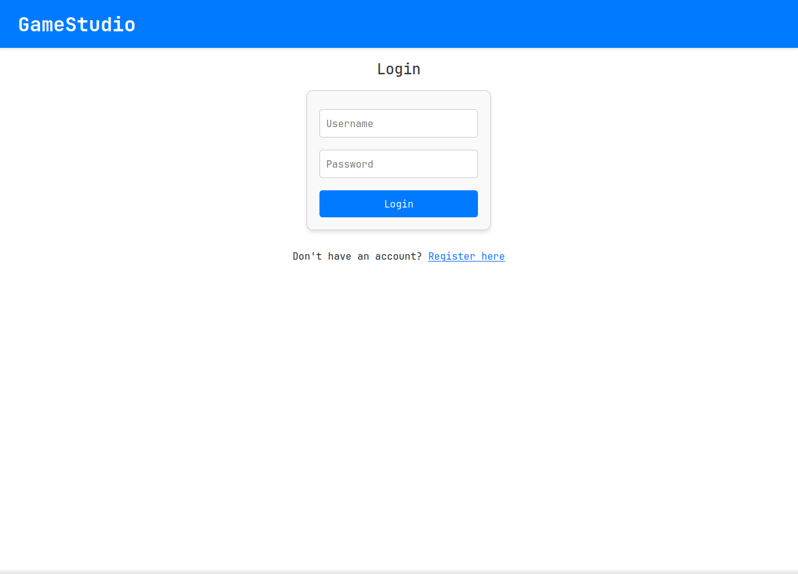
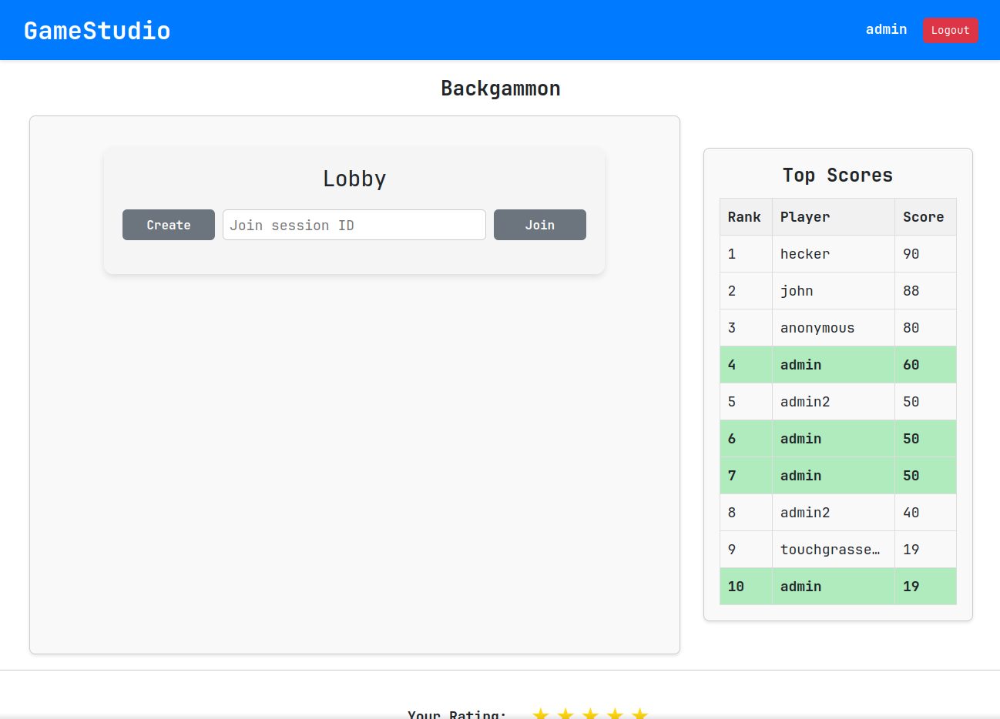
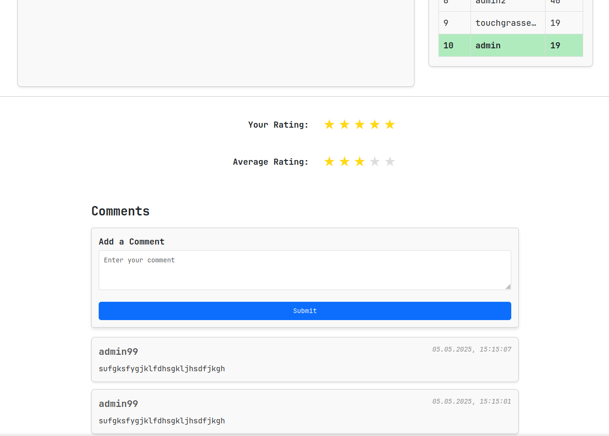
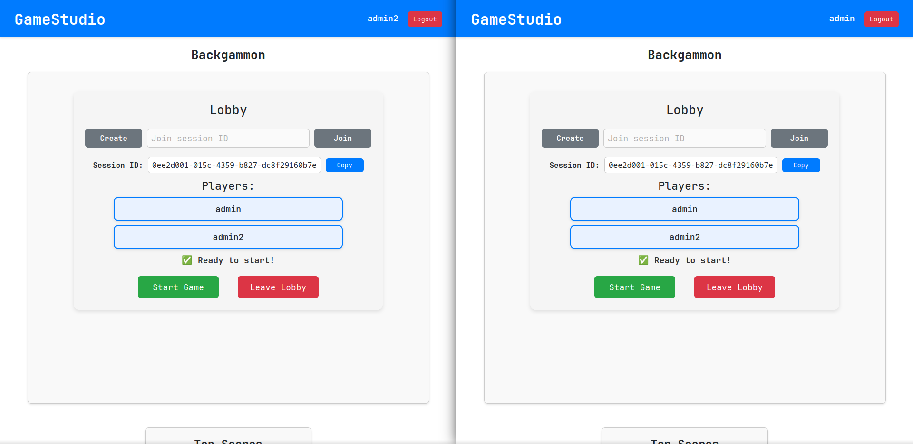
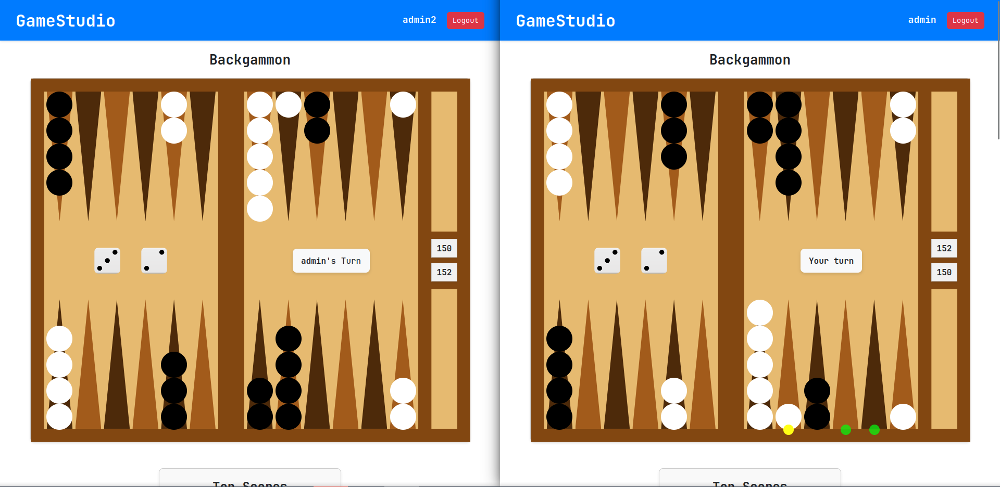

# 🎲 Backgammon (.NET Backend)

Backend for the [Backgammon game project](https://github.com/vilisvit/backgammon), built with **ASP.NET Core**.
Frontend has minor modifications for use of SignalR instead of STOMP.

## ✨ Features

- Real-time multiplayer gameplay via SignalR and WebSockets
- JWT authentication
- REST API for lobby and game
- Onion Architecture
- EF Core with PostgreSQL
- AutoMapper for DTO mapping

## 🧱 Architecture

```
Backgammon.sln
├── frontend/                   → React frontend (SignalR support added)
├── Backgammon.GameCore        → Game logic
├── Backgammon.Core            → Domain
├── Backgammon.Infrastructure  → DB & repositories
├── Backgammon.WebAPI          → REST API + SignalR
```

## 🚀 Setup

### Prerequisites

- .NET 8 SDK
- PostgreSQL
- Node.js (for frontend)

### Config

In `Backgammon.WebAPI/appsettings.Development.json`:

```json
{
  "ConnectionStrings": {
    "DefaultConnection": "Host=localhost;Database=backgammon;Username=postgres;Password=yourpassword"
  },
  "Jwt": {
    "Key": "yourkey",
    "Issuer": "BackgammonApp",
    "Audience": "BackgammonUsers"
  },
  "CorsOrigins": [ "http://localhost:3000" ]
}
```

### Run
#### Backend
```bash
dotnet run --project Backgammon.WebAPI
```
#### Frontend
```bash
cd frontend
npm install
npm start
```

## 📸 Screenshots

<table>
  <tr>
    <td align="center"><strong>🔐 Login Page</strong></td>
    <td align="center"><strong>👥 Lobby and Scores</strong></td>
  </tr>
  <tr>
    <td></td>
    <td></td>
  </tr>
  <tr>
    <td align="center"><strong>💬 Ratings and Comments</strong></td>
    <td align="center"><strong>🧩 Two Players in Lobby</strong></td>
  </tr>
  <tr>
    <td></td>
    <td></td>
  </tr>
  <tr>
    <td colspan="2" align="center"><strong>🎯 Real-Time Gameplay</strong></td>
  </tr>
  <tr>
    <td colspan="2" align="center"></td>
  </tr>
</table>

## 📄 License

This project is licensed under the [MIT License](./LICENSE).
